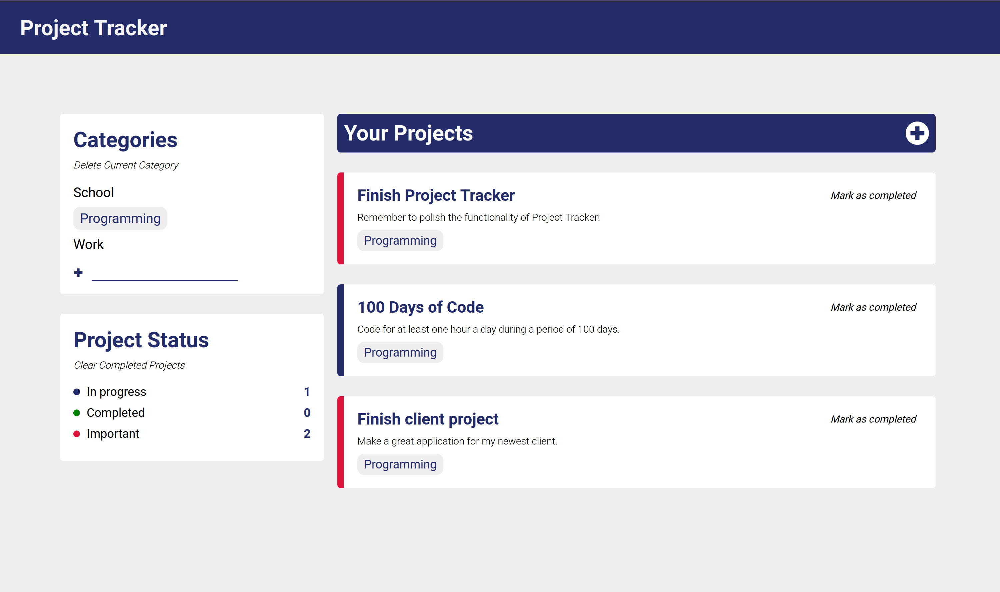
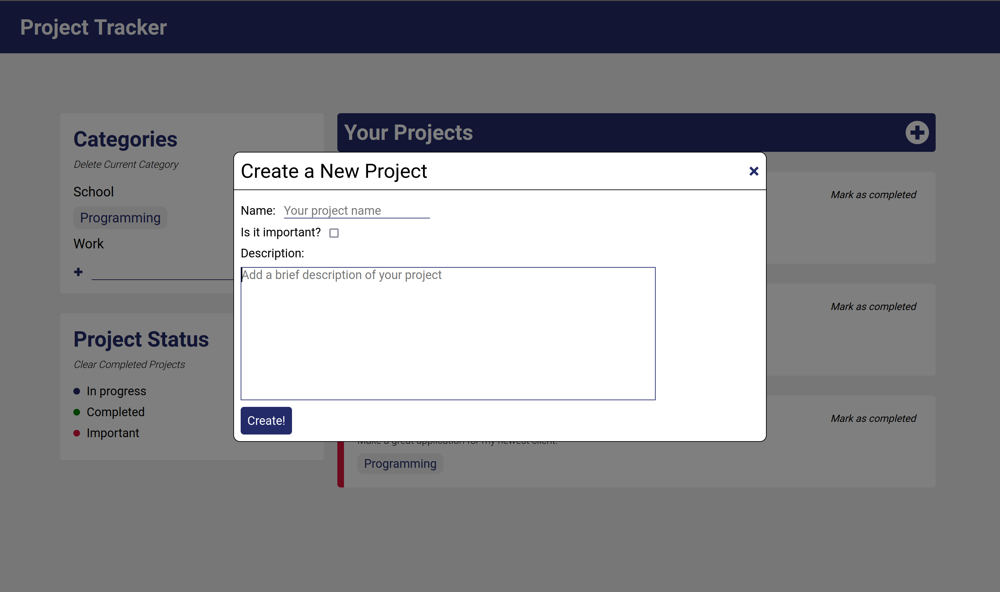

# Project Tracker

## General Information

This is a Project tracking application that allows the user to save their future projects and keep them organized by categories. It also allows the user to track the status of the projects (in progress, completed and important).

My main inspiration to develop this small web application was to strenghten my vanilla JavaScript skills. I wanted to level up my code by paying attention on writing readable code. I also wanted to review important web dev concepts, such as local storage and manipulating the DOM through code.

## Technologies
- HTML
- CSS
- JavaScript

## Usage 
The website is hosted on Github Pages at the following URL:

https://carlosp1806.github.io/project-tracker-app/

The user first needs to create a new category to start storing their projects (eg. school, work, etc). Then, a button will appear, so that the user can fill in a form to create a new project. The web app allows the user to mark projects as completed and also to clear the currently completed projects. The status of the projects is always automatically updated.

The following is a sample image of the project's functionality:

## Features
- Categorize projects according to user's needs
- Save user's projects to local storage 
- Keep track of the status of current projects
- Mark projects as completed
- Mobile and Desktop responsive